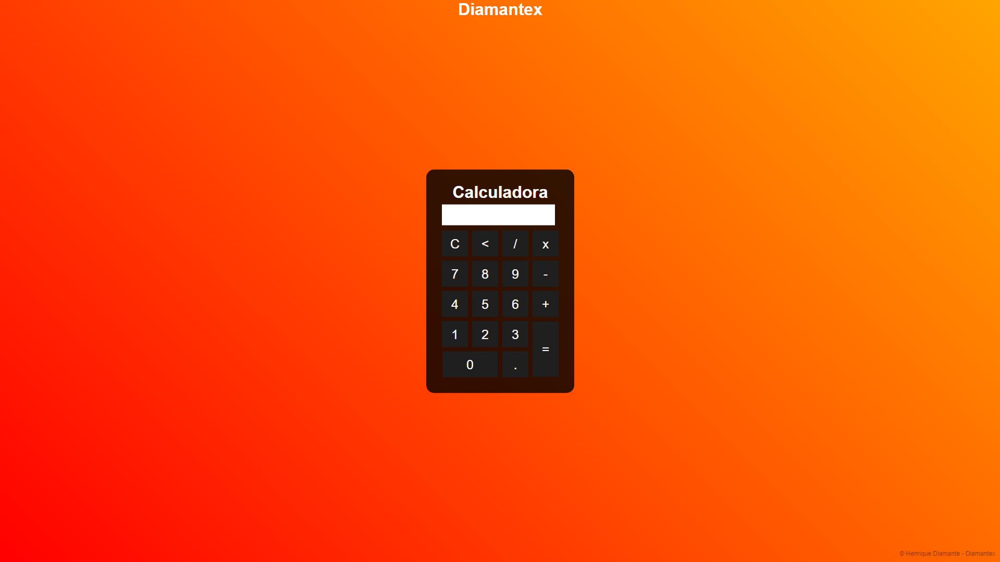

# Calculadora Interativa

Calculadora simples e funcional, criada com HTML, CSS e JavaScript, projetada para realizar operações matemáticas básicas de forma prática e eficiente. Com um design moderno e responsivo, é fácil de usar e se adapta bem a diferentes tamanhos de tela.

## 🎬 Pré-visualização

Veja abaixo uma captura de tela da calculadora em funcionamento:




## 📋 Funcionalidades

- **Operações Matemáticas Básicas**: Adição, subtração, multiplicação e divisão.
- **Limpeza e Correção**: Botões de "C" para limpar e "<" para apagar o último dígito.
- **Resposta Imediata**: Pressione "=" para calcular instantaneamente o resultado da expressão.
- **Interface Responsiva**: Design adaptável a diferentes dispositivos e tamanhos de tela.
- **Marca d'Água**: Proteção contra clonagem com uma marca d'água discreta.

## 🛠️ Tecnologias Utilizadas

- **HTML**: Estrutura da calculadora e layout da página.
- **CSS**: Estilo e design responsivo para uma experiência de usuário agradável.
- **JavaScript**: Lógica para funcionamento das operações matemáticas e interação com o usuário.

## 📂 Estrutura do Projeto

O projeto é composto pelos seguintes arquivos:

```plaintext
Calculadora/
├── css/
│   └── style.css        # Estilos e layout da calculadora
├── js/
│   └── script.js        # Lógica de operações e interações
├── index.html           # Estrutura principal do projeto
└── preview.png          # Imagem de pré-visualização do projeto
```

## 🚀 Como Usar

1. Clone este repositório para o seu ambiente local:
    ```bash
    git clone https://github.com/usuario/calculadora
    ```

2. Abra o arquivo `index.html` no navegador.

3. Experimente realizar cálculos matemáticos utilizando os botões da calculadora.

## 👤 Autor

Desenvolvido por [Diamantex](https://github.com/DiamantexDev).


